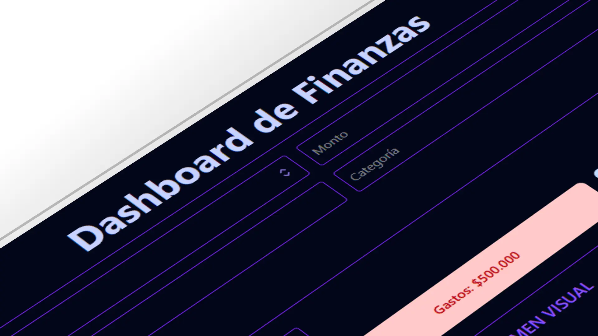

# 📊 Dashboard de Finanzas Personales

[](https://vitejs.dev/)
[](https://react.dev/)
[](https://tailwindcss.com/)
[](https://recharts.org/)
[](https://vercel.com/)

> **Demo en vivo:** [Haz clic aquí para ver la app](https://dashboard-finanzas-personales.vercel.app/)

---

## 📸 Captura de pantalla



---

## 📝 Descripción

**Dashboard de Finanzas Personales** es una aplicación moderna y responsiva para visualización de datos, construida con **Vite**, **React**, **Tailwind CSS** y **Recharts**.  
Está diseñada para mostrar métricas clave de forma clara e interactiva, ideal para paneles de control de negocios, analytics o reportes.

---

## ✨ Características
- 📊 Gráficos dinámicos con **Recharts**
- 📱 Diseño 100% responsivo con **Tailwind CSS**
- ⚡ Renderizado ultra rápido con **Vite**
- 🎨 Tema moderno y minimalista
- 🔄 Componentes reutilizables y escalables

---

## 🚀 Tecnologías utilizadas
- **Vite** — Bundler moderno
- **React** — Librería UI
- **Tailwind CSS** — Framework CSS utilitario
- **Recharts** — Librería de gráficos
- **ESLint** — Linter para mantener calidad de código

---

## 📦 Instalación

```bash
# Clonar repositorio
git clone https://github.com/Rodden87/dashboard-finanzas-personales.git

# Entrar en el directorio
cd finanzas-dashboard

# Instalar dependencias
npm install
